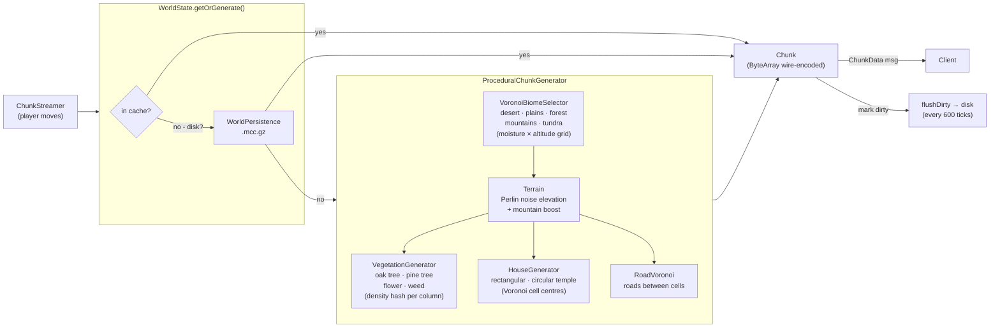
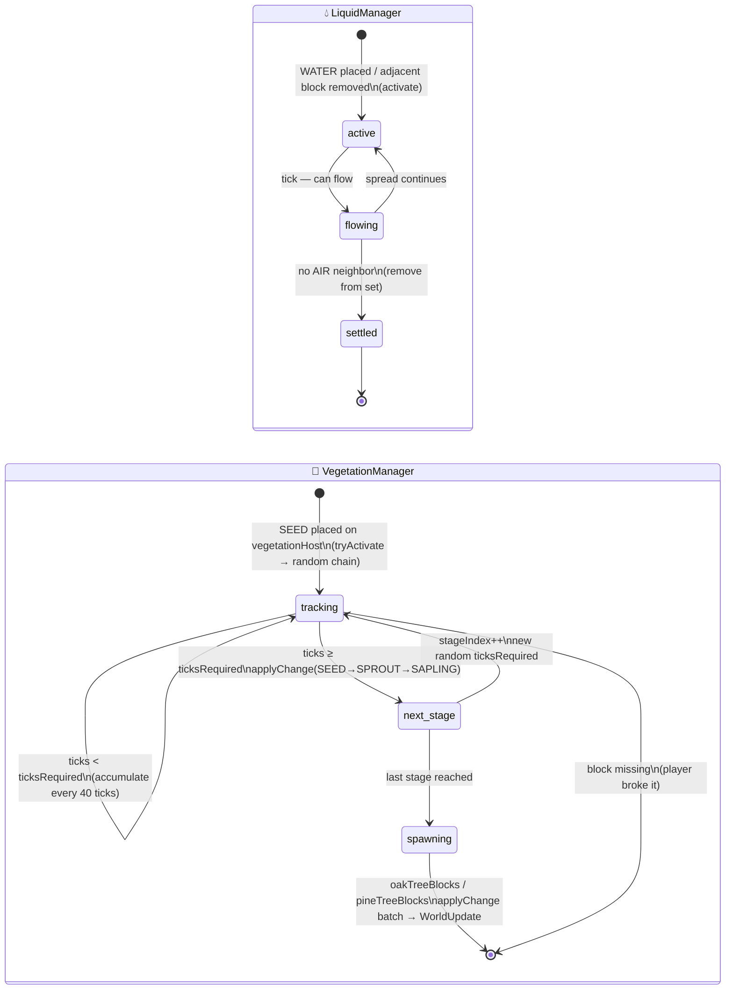

# MicCraft

**MicCraft** is a Minecraft-inspired multiplayer voxel game built with **Kotlin Multiplatform**. It runs a Ktor WebSocket server with authoritative physics and serves a browser client via Kotlin/Wasm + BabylonJS. Procedural terrain generation, biome system, liquid physics, NPC entities, weather zones, and a plugin-based slash command system.

---

## Table of Contents

- [Features](#features)
- [Architecture](#architecture)
- [Slash Commands](#slash-commands)
- [Development](#development)
- [Running the Apps](#running-the-apps)
- [Running Tests](#running-tests)
- [Contributing](#contributing)

---

## Features

### World & Terrain

- **Procedural generation** — Perlin noise terrain, Voronoi roads, vegetation, houses (rectangular and circular temple)
- **Biomes** — 5 biome types (desert, plains, forest, mountains, tundra) via Voronoi cells with moisture/altitude gradients and blend zones
- **Blocks** — 20 types: stone, dirt, grass, sand, sandstone, gravel, snow, oak/pine logs and leaves, flower, weed, water, seed, sprout, sapling
- **Liquid physics** — water source blocks flow with configurable viscosity; biome lakes generated at world creation
- **Vegetation growth** — seed → sprout → sapling → tree; configurable per-stage tick durations in `vegetation.yaml`

### Gameplay

- **Block breaking & placement** — hardness-based break time, YAML-driven drop tables with weighted randomness
- **Item inventory** — 7 collectable materials, 10-slot hotbar, drag-and-drop inventory UI
- **Player stances** — standing (speed 4.5, h 1.8) / sneaking (1.3, 1.5) / crawling (1.0, 0.6)
- **Undo** — `/undo [N]` reverts last N block breaks including item collection
- **Flying & speed** — toggleable fly mode and speed boost

### Multiplayer & Server

- **Server-authoritative** — client sends `MoveIntent`, server validates and replies `PlayerUpdate`
- **Client-side prediction** — `GameClient` predicts XZ locally at ~60 fps and soft-corrects toward server
- **Dynamic chunk streaming** — view radius 3 chunks, forward bias 7 chunks
- **Chat system** — multi-channel with `/createchat`, `/join`, `/leave`, `/talk` (private)
- **Weather zones** — rain, storm, snow, fog spawned dynamically with drift and radius
- **NPC entities** — 4 types (SELLER, BLACK_SMITH, GOAT, DUCK) with static, interactable, and random-wander behaviors

### Infrastructure

- **Auth** — three modes: `none`, `local` (bcrypt), `oauth` (Google Authorization Code)
- **i18n** — English + French, hot-reloadable via `/reload`
- **Plugin system** — `PluginCommand` interface; plugins discovered at runtime via ClassGraph
- **UI layout editor** — move/resize widgets on a 48×48 grid, persisted per player
- **Shaders** — ambient occlusion, directional shading, fog toggle via `/shaders`
- **World persistence** — chunks saved as gzip binary, players as JSON

---

## Architecture

### World Generation Pipeline

Chunks are generated on demand: `ChunkStreamer` requests a chunk → `WorldState.getOrGenerate()` checks the in-memory cache, then disk, then runs the generator.



### Game Loop — Tick Sequence

The server runs at **20 tps (50 ms/tick)**. Each tick drives player input, physics, automatic world managers, and periodic housekeeping.


### Chunk Transport Modes

The server selects the transport via `Welcome.chunkTransport`; the client switches mode on connect.

| Mode | Delivery | Download priority | Mesh priority |
|------|----------|-------------------|---------------|
| `websocket` | Server pushes `ChunkData` frames over `/chunks` WS | Server-controlled (no client ordering) | ✅ sorted by proximity + FoV at drain time |
| `http` | `HttpChunkFetcher` pulls chunks on demand (max 4 concurrent) | ✅ priority queue, gated by FoV readiness | ✅ sorted by proximity + FoV at drain time |

**Priority tiers (score bands)**

| Tier | Condition | Score | Gated until… |
|------|-----------|-------|---------------|
| 1 | Under player (dx=0, dz=0) | 0 | — |
| 2 | Radius ≤ 1 (incl. diagonals) | 1000+ | — |
| 3 | FoV ≤ 60° | 2000+ | — |
| 4 | dist > halfR (any direction) | 3000+ | near-FoV chunks meshed |
| 5 | dist ≤ halfR, outside 60° FoV | 4000+ | near-FoV chunks meshed |

In `websocket` mode the download tier ordering is server-side only; the **mesh queue is re-sorted** on every drain tick so the client always meshes closest/FoV chunks first regardless of arrival order.

### Automatic Manager State Machine

Both `LiquidManager` and `VegetationManager` follow the same pattern: an in-memory set of active positions is mutated by world events, consumed by the tick, and produces `WorldUpdate` broadcasts to all clients.



---

## Slash Commands

<!-- BEGIN_COMMANDS -->

### Core commands

| Command | Usage | Description | Options / Autocomplete |
|---------|-------|-------------|------------------------|
| `/adduser` | `/adduser <email> <password> [displayName]` | Add a local auth user. Usage: /adduser <email> <password> [displayName] | — |
| `/codex` | `/codex` | Opens the codex (blocks, items, bestiary). | — |
| `/config` | `/config <get\|set> <key> [value]` | Get or set a runtime config value. | — |
| `/config:reload` | `/config:reload` | Reloads block or NPC definitions from resource files. | block, npc |
| `/createchat` | `/createChat <channelName>` | Create a new chat channel. | — |
| `/disconnect` | `/disconnect` | Déconnecte le joueur courant. | — |
| `/give` | `/give <itemType> [N]` | Give items to yourself. | dynamic |
| `/help` | `/help [command]` | Lists available commands. | — |
| `/join` | `/join <channelName>` | Join a chat channel. | — |
| `/lang` | `/lang [locale]` | Changes your language preference. | — |
| `/layout` | `/layout <name>` | Switches to a named layout. | — |
| `/layouts` | `/layouts` | Opens the layout editor. | — |
| `/leave` | `/leave <channelName>` | Leave a chat channel. | — |
| `/preferences` | `/preferences` | Opens the preferences panel. | — |
| `/pump` | `/pump` | Remove all connected liquid blocks in sight. | — |
| `/refetch` | `/refetch` | Reloads all chunks around the player. | — |
| `/reload` | `/reload` | Reloads configuration files without restarting the server. | drops.yaml — block drop table, biomes.yaml — biome definitions, i18n/*.yaml — translations |
| `/save` | `/save` | Saves the world and player state to disk. | — |
| `/shaders` | `/shaders [on\|off]` | Toggles visual shaders (ambient occlusion, directional shading, fog). | on, off |
| `/spawn` | `/spawn <npc_model> [x y z]` | Spawn an NPC of the given model on the solid block you are looking at. (admin) | dynamic |
| `/talk` | `/talk <playerName>` | Open a private chat with a player. | — |
| `/time` | `/time [0-23]` | Shows or sets the in-game time. | dynamic |
| `/undo` | `/undo [N]` | Undo the last N block breaks, restoring blocks and reversing item collection. | — |
| `/water` | `/water [x y z]` | Place a water source on the solid block you are looking at (or x y z). (admin) | dynamic |
| `/weather` | `/weather [rain\|storm\|snow\|fog\|none]` | Force a weather zone at your position or clear all zones. (admin) | rain, storm, snow, fog, none |
| `/weather-forecast` | `/weather-forecast` | Shows active weather zones and their location. | — |

### Plugin commands

| Command | Usage | Description | Options / Autocomplete |
|---------|-------|-------------|------------------------|
| `/goto` | `/goto <playerName\|npcName>` | Teleports you to a player or NPC. | — |
| `/kick` | `/kick <playerName>` | Kicks a connected player. | — |
| `/npc` | `/npc <spawn\|list\|remove\|tp> [args]` | Manage NPCs in the world. | — |
| `/summon` | `/summon <playerName>` | Teleports another player to your location. | — |
| `/teleport` | `/teleport <x> <y> <z>  \|  /teleport <playerName>` | Teleports you to the given coordinates. | — |
| `/who` | `/who` | Lists connected players with their position. | — |
| `/yield` | `/yield <message>` | Broadcasts a message to all connected players. | — |

<!-- END_COMMANDS -->

Commands are discovered at runtime — add a class implementing `CommandHandler` (or `PluginCommand` for plugins) and it appears automatically.

To regenerate this section from source:
```bash
node scripts/generate_commands_docs.mjs
```

---

## Development

### Prerequisites

- **Docker** + **Docker Compose** — all build/run/test commands execute inside the dev container
- **Make** — task runner
- **Node.js** (host) — for `scripts/generate_commands_docs.mjs` and `rtk`

### Dev container

```bash
make dev-up                   # build image and start container (detached)
make shell                    # open bash inside container
make dc CMD="<any command>"   # run any command inside container
```

## Commands

```bash
make dev-up                                          # start dev container (foreground)
make dc CMD="./gradlew dev"                          # server :8080
make dc CMD="./gradlew devDebug"                     # debug texture mode
make dc CMD="./gradlew build"                        # full build
make dc CMD="./gradlew test"                         # all tests
make dc CMD="./gradlew :server:test"                 # server tests only
make dc CMD="./gradlew :app:shared:jvmTest"
make dc CMD="./gradlew ktlintCheck"
make dc CMD="./gradlew :server:addUser -Pargs='email pass [name]'"
```

### Code formatting

```bash
make dc CMD="./gradlew :spotlessApply"   # Kotlin (ktlint via Spotless)
make dc CMD="npm run format"             # TypeScript (Prettier)
# or both at once:
make code-standard
```

### Debug texture mode

Single GRASS block at (8, 2, 8); player spawns in fly mode at (8, 1, 14). Keys 1–6 position camera on each face.

```bash
make dc CMD="./gradlew devDebug"
# then open: http://localhost:8081/?debug&bx=8&by=2&bz=8
```

### Adding a command

1. Create `server/src/main/kotlin/.../command/MyCommand.kt` implementing `CommandHandler`
2. Set `command`, `description`, `usage`, `options` properties
3. Implement `execute()` — the command is auto-discovered at runtime, no registration needed
4. Regenerate docs: `node scripts/generate_commands_docs.mjs`

### Adding a plugin command

Same as above but implement `PluginCommand` and place the file under `plugins/<name>/server/`.

### Server hot-reload

After any server-side change:

```bash
touch run.lock   # watchdog restarts Ktor; web client reconnects automatically
```

### Generate README commands section

```bash
make docs
```

---

## Running the Apps

```bash
make dev-up                              # start dev container
make dc CMD="./gradlew dev"              # server :8080
make dc CMD="./gradlew devDebug"         # debug texture mode
```

---

## Running Tests

```bash
make dc CMD="./gradlew :server:test"           # server (Kotlin/JVM)
make dc CMD="./gradlew :app:shared:jvmTest"    # shared module (JVM)
make dc CMD="./gradlew :app:shared:wasmJsTest" # shared module (Wasm)
make dc CMD="./gradlew test"                   # all targets
```

---

## Contributing

1. Fork the repository and create a feature branch
2. Follow **Conventional Commits** (`feat:`, `fix:`, `chore:`, etc.) — subject ≤ 72 chars, body ≤ 10 lines
3. Run `make code-standard` before opening a PR
4. Server-side changes (`server/src/main/`) require a new or updated test in `server/src/test/`
5. New user-visible strings must be added to **both** `data/i18n/en.yaml` and `data/i18n/fr.yaml`
6. Update the relevant JSON Schema in `data/schemas/` when modifying YAML-backed data classes
