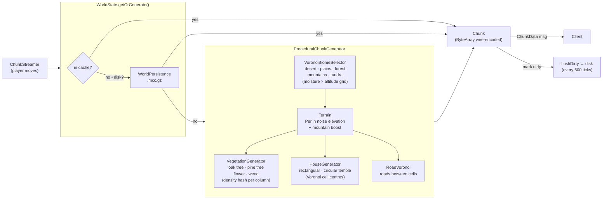
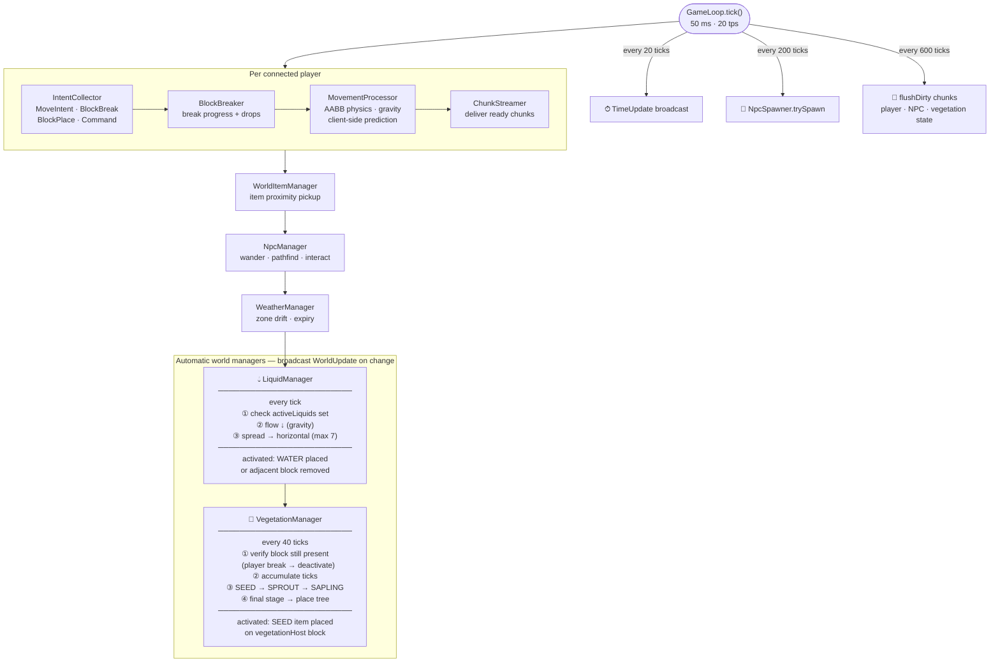
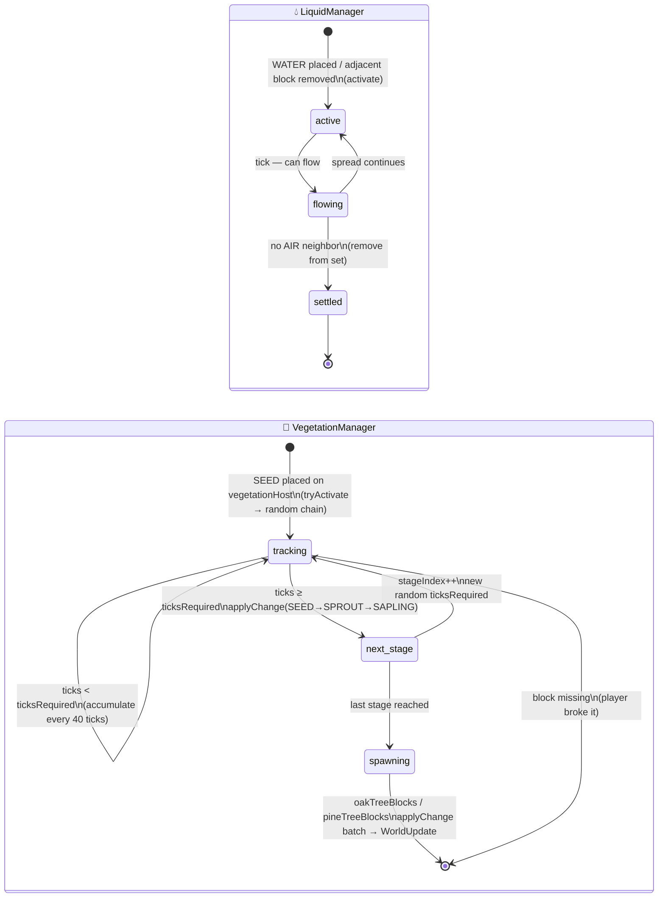

# MicCraft

**MicCraft** is a Minecraft-inspired multiplayer voxel game built with **Kotlin Multiplatform**. It runs a Ktor WebSocket server with authoritative physics and serves a browser client via Kotlin/Wasm + BabylonJS. Procedural terrain generation, biome system, liquid physics, NPC entities, weather zones, and a plugin-based slash command system.

---

## Table of Contents

- [Features](#features)
- [Architecture](#architecture)
- [Slash Commands](#slash-commands)
- [API Routes](#api-routes)
- [Development](#development)
- [Running the Apps](#running-the-apps)
- [Running Tests](#running-tests)
- [Contributing](#contributing)

---

## Features

### URLs
 - [Main game **/**](http://127.0.0.1:8080/)
 - [Map **/map**](http://127.0.0.1:8080/map)
 - [Administration **/admin/**](http://127.0.0.1:8080/admin/)
 - [API doc **/api/docs**](http://127.0.0.1:8080/api/docs)

### World & Terrain

- **Procedural generation** — Perlin noise terrain, Voronoi roads, vegetation, houses (rectangular and circular temple)
- **Biomes** — 5 biome types (desert, plains, forest, mountains, tundra) via Voronoi cells with moisture/altitude gradients and blend zones
- **Blocks** — 20 types: stone, dirt, grass, sand, sandstone, gravel, snow, oak/pine logs and leaves, flower, weed, water, seed, sprout, sapling
- **Liquid physics** — water source blocks flow with configurable viscosity; biome lakes generated at world creation
- **Vegetation growth** — seed → sprout → sapling → tree; configurable per-stage tick durations in `vegetation.yaml`

### Gameplay

- **Block breaking & placement** — hardness-based break time, YAML-driven drop tables with weighted randomness
- **Item inventory** — 7 collectable materials, 10-slot hotbar, drag-and-drop inventory UI
- **Player stances** — standing (speed 4.5, h 1.8) / sneaking (1.3, 1.5) / crawling (1.0, 0.6)
- **Undo** — `/undo [N]` reverts last N block breaks including item collection
- **Flying & speed** — toggleable fly mode and speed boost
- **Crafting** — recipe panel (`/craft`), recipe unlocking (`/learnrecipe`), `RecipeRegistry` loaded from YAML; craft directly via `/docraft <recipeId> [count]`
- **Lighting override** — `/light:on` boosts ambient light underground; `/light:off` restores natural darkness
- **Explosion** — `/explode <radius>` destroys all blocks in a sphere (admin)

### Multiplayer & Server

- **Server-authoritative** — client sends `MoveIntent`, server validates and replies `PlayerUpdate`
- **Client-side prediction** — `GameClient` predicts XZ locally at ~60 fps and soft-corrects toward server
- **Dynamic chunk streaming** — view radius 3 chunks, forward bias 7 chunks
- **Chat system** — multi-channel with `/createchat`, `/join`, `/leave`, `/talk` (private), proximity-based `around` channel (radius 64 blocks), combat log channel
- **Weather zones** — rain, storm, snow, fog spawned dynamically with drift and radius; `/weather-forecast` shows active zones and distance
- **NPC entities** — multiple types (SELLER, BLACK_SMITH, GOAT, DUCK, WOLF, CAT, BEAR, POLAR_BEAR, …) with static, interactable, random-wander, and hostile-aggro behaviors; Blockbench bbmodel animations with configurable walk-bone aliases
- **Animal lifecycle** — age in game-days, hunger meter, gestation timer, reproduction cooldown, mother level; all fields tracked and visible in admin NPC panel

### Combat & RPG

- **RPG classes** — character classes with STR/DEX/INT/WIS/CON/CHA base stats, class resource (mana/rage/tokens), per-level attack and spell access, HP/mana/rage formulas configurable in `classes.yaml`; derived stats computed from base + class bonus + equipped armor bonuses
- **Attack system** — attacks and spells with cooldown tracking, resource checks, and draggable action bar (`AttackPanel`); spell processor (`SpellProcessor`) runs alongside attack processor
- **Status effects** — `StatusEffectProcessor` applies timed buffs/debuffs; HP/mana regeneration via `RegenProcessor`
- **Combat target frame** — HP bar + target info overlay for the focused entity (`CombatTargetFrame`)
- **Aggro indicators** — angular proximity indicators showing nearby hostile NPCs (`AggroIndicators`)
- **XP / level** — experience bar and level display (`XpBar`); `ExperienceProcessor` handles XP gains and level-up
- **Player status** — HP, mana, stamina bars with downed/respawn overlay (`PlayerStatusBar`, `PlayerDownedOverlay`); `/resurect [playerName]` to revive
- **God mode** — `/god:on` / `/god:off` makes the player immune to damage (admin)
- **Rest** — `/rest` instantly restores rage and tokens to maximum
- **Quest system** — quest journal (key `J`) and persistent on-screen quest tracker widget (`QuestJournal`, `QuestTracker`); KILL and FETCH quest types; `/quest [list|accept|abandon|status] [id]`
- **Player-to-player trade** — `/trade <playerName>` initiates a trade session, `/tradeoffer <tradeId> <json>` updates the offer, `/tradeaccept` / `/tradecancel` to finalise or cancel
- **Skin customisation** — `/skin <skinName>` to switch player skin; skins defined as bbmodel presets
- **Statistics** — toggleable performance and game-stats overlay

### Character

- **Character screen** — armor equip/unequip per slot with 3-D player model preview (key `Y`, or Pause → Character)
- **Character creation** — name + skin selection at first login (`CharacterCreationScreen`, `CharacterRPGCreationScreen`); `/createcharacter` in-game; `/skiprpg` to opt out of the RPG system entirely
- **Character selection** — choose or create a character on login (`CharacterSelectionScreen`)
- **Character sheet** — `/character` shows current class, level, XP, base stats, HP/mana/rage, and equipped armor bonuses

### Pages

| URL | Purpose |
|-----|---------|
| `/` | Game client (Kotlin/Wasm + BabylonJS) |
| `/map` | Live top-down SVG world map — toggleable layers (biome borders, zone names, contours, vegetation, houses, roads, chunks, weather, staircases, players, NPCs), player/NPC follow mode, zoom, fit-all |
| `/admin` | Admin panel — 7 pages: **Status** (TPS, connected players, loaded chunks, game time control, network, heap, CPU; server restart button), **Users** (create/update/delete local auth accounts, group assignment), **Players** (list, keybindings, preferences, RPG stats, rename), **NPCs** (live WebSocket feed with filter by type/zone/level/gender/aggro; detail panel with animal state: age, hunger, gestation, reproduction), **Classes** (RPG class definitions and per-level attack/spell access), **Worlds** (browser with seed/chunk count/creation date; create new world), **Config** (live YAML editor with JSON Schema validation) |

### Infrastructure

- **Auth** — three modes: `none`, `local` (bcrypt), `oauth` (Google Authorization Code)
- **RBAC** — group-based permissions; groups assigned via `/rbac:setgroup` / `/rbac:removegroup`; command-level `permission` field gated by session groups; disabled-commands per player stored in player state
- **i18n** — English + French, hot-reloadable via `/reload`
- **Plugin system** — `PluginCommand` interface; plugins discovered at runtime via ClassGraph; plugins can register tick handlers and commands; UUID collision detection at startup
- **Macro system** — `MacroExecutor` evaluates scripted macro sequences; macros accessible via `MacrosController` HTTP routes
- **Screenshot** — `ScreenshotController` exposes a screenshot endpoint
- **UI layout editor** — move/resize widgets on a 48×48 grid, persisted per player
- **Shaders** — ambient occlusion, directional shading, fog toggle via `/shaders`
- **Metrics** — `MetricsController` exposes server performance metrics (heap, non-heap, tick counters, liquid/vegetation estimates)
- **World persistence** — chunks saved as gzip binary, players as JSON; NPCs and vegetation state flushed every 600 ticks

---

## Architecture

### World Generation Pipeline

Chunks are generated on demand: `ChunkStreamer` requests a chunk → `WorldState.getOrGenerate()` checks the in-memory cache, then disk, then runs the generator.



### Game Loop — Tick Sequence

The server runs at **20 tps (50 ms/tick)**. Each tick drives player input, physics, automatic world managers, and periodic housekeeping.



### Chunk Transport Modes

The server selects the transport via `Welcome.chunkTransport`; the client switches mode on connect.

| Mode | Delivery | Download priority | Mesh priority |
|------|----------|-------------------|---------------|
| `websocket` | Server pushes `ChunkData` frames over `/chunks` WS | Server-controlled (no client ordering) | ✅ sorted by proximity + FoV at drain time |
| `http` | `HttpChunkFetcher` pulls chunks on demand (max 4 concurrent) | ✅ priority queue, gated by FoV readiness | ✅ sorted by proximity + FoV at drain time |

**Priority tiers (score bands)**

| Tier | Condition | Score | Gated until… |
|------|-----------|-------|---------------|
| 1 | Under player (dx=0, dz=0) | 0 | — |
| 2 | Radius ≤ 1 (incl. diagonals) | 1000+ | — |
| 3 | FoV ≤ 60° | 2000+ | — |
| 4 | dist > halfR (any direction) | 3000+ | near-FoV chunks meshed |
| 5 | dist ≤ halfR, outside 60° FoV | 4000+ | near-FoV chunks meshed |

In `websocket` mode the download tier ordering is server-side only; the **mesh queue is re-sorted** on every drain tick so the client always meshes closest/FoV chunks first regardless of arrival order.

### Automatic Manager State Machine

Both `LiquidManager` and `VegetationManager` follow the same pattern: an in-memory set of active positions is mutated by world events, consumed by the tick, and produces `WorldUpdate` broadcasts to all clients.



---

## Slash Commands

<!-- BEGIN_COMMANDS -->

### Core commands

| Command | Usage | Description | Options / Autocomplete |
|---------|-------|-------------|------------------------|
| `/buff` | `/buff <hp\|mana\|hpregen\|manaregen>` | Apply a temporary buff to yourself. | hp, mana, hpregen, manaregen |
| `/character` | `/character` | Show your RPG character sheet | — |
| `/codex` | `/codex` | Opens the codex (blocks, items, bestiary). | — |
| `/config` | `/config <get\|set> <key> [value]` | Get or set a runtime config value. | dynamic |
| `/config:reload` | `/config:reload` | Reloads block, NPC, or RBAC definitions from resource files. | block, npc, rbac |
| `/craft` | `/craft` | Opens the crafting window. | — |
| `/createcharacter` | `/createcharacter <name> <class> <str> <dex> <intel> <wis> <con> <cha>` | Create your RPG character | — |
| `/createchat` | `/createchat <channelName>` | Create a new chat channel. | — |
| `/disconnect` | `/disconnect` | Déconnecte le joueur courant. | — |
| `/docraft` | `/docraft <recipeId> [count]` | Crafts a recipe. | — |
| `/drink` | `/drink <itemType>` | Consomme un item consommable de l'inventaire. | — |
| `/equip` | `/equip <armorName>` | Equip an armor piece. | dynamic |
| `/explode` | `/explode <radius>` | Destroy all blocks in a sphere around the player. | — |
| `/give` | `/give <name> [N]` | Give an item, or grant an armor/weapon/tool, to yourself. | dynamic |
| `/give:money` | `/give:money <amount> [playerName]` | Give copper to a player (or yourself if name omitted). | — |
| `/god:off` | `/god:off` | Disable god mode. | — |
| `/god:on` | `/god:on` | Enable god mode (immune to damage). | — |
| `/help` | `/help [command]` | Lists available commands. | — |
| `/join` | `/join <channelName>` | Join a chat channel. | dynamic |
| `/lang` | `/lang [locale]` | Changes your language preference. | — |
| `/layout` | `/layout <name>` | Switches to a named layout. | — |
| `/layouts` | `/layouts` | Opens the layout editor. | — |
| `/learnrecipe` | `/learnrecipe <recipeId>` | Teach a recipe to the player. | — |
| `/leave` | `/leave <channelName>` | Leave a chat channel. | dynamic |
| `/light:off` | `/light:off` | Restores natural cavern darkness. | — |
| `/light:on` | `/light:on` | Boosts ambient light underground (cavern lighting override). | — |
| `/mail` | `/mail` | Open your mailbox. | — |
| `/map` | `/map` | Toggles the biome map overlay. | — |
| `/mode` | `/mode <game\|creative>` | Switch between normal game mode and creative edit mode. (admin) | game, creative |
| `/mount` | `/mount` | Mount or dismount the vehicle you're targeting. | — |
| `/npcbuy` | `/npcbuy <npcId> <itemType> [quantity]` | Buy an item from a seller NPC. | — |
| `/npcsell` | `/npcsell <npcId> <itemType> [quantity]` | Sell an item to a seller NPC. | — |
| `/preferences` | `/preferences` | Opens the preferences panel. | — |
| `/pump` | `/pump` | Remove all connected liquid blocks in sight. | — |
| `/quest` | `/quest [list\|accept\|abandon\|status] [id]` | Manage your quests. | dynamic |
| `/refetch` | `/refetch` | Reloads all chunks around the player. | — |
| `/reload` | `/reload` | Reloads configuration files without restarting the server. | resources/blocks/*.yaml — block properties + drop tables, biomes.yaml — biome definitions, i18n/*.yaml — translations |
| `/rest` | `/rest` | Take a short rest: restore rage and tokens to maximum. | — |
| `/resurect` | `/resurect [playerName]` | Resurrect a downed player (self if no name given). | dynamic |
| `/save` | `/save` | Saves the world and player state to disk. | — |
| `/scene:place` | `/scene:place <sceneId> <rotation:0-3> <x> <y> <z>` | Stamp a scene into the live world at the given position. | — |
| `/set` | `/set <hp\|mana> <playerName> <value>` | Set a player stat. | dynamic |
| `/shaders` | `/shaders [on\|off]` | Toggles visual shaders (ambient occlusion, directional shading, fog). | on, off |
| `/siege_weapon` | `/siege_weapon <rotation\|pitch\|power> <value>` | Set the targeted siege weapon's rotation, pitch, or power. | dynamic |
| `/skin` | `/skin <skinName>` | Changes your player skin. | dynamic |
| `/skiprpg` | `/skiprpg` | Opt out of RPG system | — |
| `/spawn` | `/spawn <npc_model> [x y z]` | Spawn an NPC of the given model on the solid block you are looking at. (admin) | dynamic |
| `/talk` | `/talk <playerName>` | Open a private chat with a player. | dynamic |
| `/time` | `/time [0-23]` | Shows or sets the in-game time. | 0, 1, 2, 3, 4, 5, 6, 7, 8, 9, 10, 11, 12, 13, 14, 15, 16, 17, 18, 19, 20, 21, 22, 23 |
| `/trade` | `/trade <playerName>` | Initiates a trade with another player. | dynamic |
| `/tradeaccept` | `/tradeaccept <tradeId>` | Accepts the current trade offer. | — |
| `/tradecancel` | `/tradecancel <tradeId>` | Cancels the current trade. | — |
| `/tradeoffer` | `/tradeoffer <tradeId> <json>` | Updates your current trade offer. | — |
| `/undo` | `/undo [N]` | Undo the last N block breaks, restoring blocks and reversing item collection. | — |
| `/unequip` | `/unequip <armorName>` | Remove an equipped armor piece. | dynamic |
| `/unwield` | `/unwield <hand>` | Empty a hand slot. | dynamic |
| `/vehicule:add` | `/vehicule:add <vehiculeName>` | Spawn a vehicle on the rail block you're standing on. | — |
| `/water` | `/water [x y z]` | Place a water source on the solid block you are looking at (or x y z). (admin) | — |
| `/weather` | `/weather [rain\|storm\|snow\|fog\|none]` | Force a weather zone at your position or clear all zones. (admin) | rain, storm, snow, fog, none |
| `/weather-forecast` | `/weather-forecast` | Shows active weather zones and their location. | — |
| `/wield` | `/wield <name> [hand]` | Wield a weapon or tool in a hand. | dynamic |

### Plugin commands

| Command | Usage | Description | Options / Autocomplete |
|---------|-------|-------------|------------------------|
| `/adduser` | `/adduser <email> <password> [displayName] [group1,group2,...]` | Add a local auth user. Usage: /adduser <email> <password> [displayName] [group1,group2,...] | — |
| `/goto` | `/goto <playerName\|npcName>` | Teleports you to a player or NPC. | dynamic |
| `/kick` | `/kick <playerName>` | Kicks a connected player. | dynamic |
| `/npc` | `/npc <spawn\|list\|remove\|tp> [args]` | Manage NPCs in the world. | — |
| `/rbac:listgroups` | `/rbac:listgroups` | List all groups and their permissions. | — |
| `/rbac:removegroup` | `/rbac:removegroup <email> <group1,group2,...>` | Remove groups from a user. | — |
| `/rbac:setgroup` | `/rbac:setgroup <email> <group1,group2,...>` | Add groups to a user. | — |
| `/summon` | `/summon <playerName>` | Teleports another player to your location. | dynamic |
| `/teleport` | `/teleport <x> <y> <z>  \|  /teleport <playerName>` | Teleports you to the given coordinates. | dynamic |
| `/who` | `/who` | Lists connected players with their position. | — |
| `/yield` | `/yield <message>` | Broadcasts a message to all connected players. | — |

<!-- END_COMMANDS -->

Commands are discovered at runtime — add a class implementing `CommandHandler` (or `PluginCommand` for plugins) and it appears automatically.

To regenerate this section from source:
```bash
make docs
# or: make dc CMD="./gradlew :server:generateCommandsDocs"
```

---

## API Routes

Full machine-readable spec: [`server/openapi/openapi.yaml`](server/openapi/openapi.yaml), browsable at `/api/docs` (Redoc) when the server is running. This table and the YAML spec are both generated from the same `@ktoropenapi`-annotated Ktor routes — never hand-edit either.

<!-- BEGIN_API_ROUTES -->

| Method | Path | Description |
|--------|------|-------------|
| GET | `/api/admin/blocks` | All registered block definitions |
| GET | `/api/admin/chunks/discovered` | All chunk coordinates generated so far (in-memory ∪ persisted) |
| GET | `/api/admin/classes` | RPG class definitions, keyed by class name |
| GET | `/api/admin/configs` | Names of all whitelisted editable YAML config files |
| GET | `/api/admin/configs/{...}` | Raw YAML content of a whitelisted config file |
| PUT | `/api/admin/configs/{...}` | Overwrite a whitelisted config file's raw YAML content |
| PUT | `/api/admin/gametime` | Set the in-game time of day |
| GET | `/api/admin/instances` | All instance zones |
| POST | `/api/admin/instances` | Create an instance zone covering already-generated chunks |
| DELETE | `/api/admin/instances/{id}` | Delete an instance zone |
| GET | `/api/admin/instances/{id}` | A single instance zone |
| PUT | `/api/admin/instances/{id}` | Rename an instance zone |
| GET | `/api/admin/instances/{id}/blocks` | Non-air blocks in an instance zone, streamed as newline-delimited JSON (application/x-ndjson, one InstanceBlockDto per line), capped at 300000 |
| PUT | `/api/admin/instances/{id}/bounds` | Update an instance zone's Y bounds |
| PUT | `/api/admin/instances/{id}/chunks` | Update the set of chunks covered by an instance zone |
| PUT | `/api/admin/instances/{id}/enabled` | Enable/disable an instance zone |
| PUT | `/api/admin/instances/{id}/layout` | Update an instance zone's clip planes and shortcut bar layout |
| GET | `/api/admin/items` | Item definitions, keyed by item type id |
| GET | `/api/admin/npc-types` | NPC type definitions (codex info), keyed by type id |
| GET | `/api/admin/npcs` | Live NPC instances with full animal/combat state |
| GET | `/api/admin/plain-colors` | All registered plain paint colors |
| GET | `/api/admin/players` | All player names |
| GET | `/api/admin/players/{name}` | Full player file (state, keybindings, RPG data) |
| PUT | `/api/admin/players/{name}/equipment` | Partially update a player's owned/equipped armor and wielded hand items |
| POST | `/api/admin/players/{name}/give` | Give an inventory item, or grant ownership of an armor/weapon/tool |
| PUT | `/api/admin/players/{name}/keybindings` | Overwrite a player's saved key bindings |
| PUT | `/api/admin/players/{name}/preferences` | Partially update a player's preferences (only given fields change) |
| POST | `/api/admin/players/{name}/rename` | Rename a player |
| PUT | `/api/admin/players/{name}/rpg` | Partially update a player's RPG class/base stats |
| POST | `/api/admin/reload` | Reload configuration files without restarting the server — same behavior as the in-game /reload command |
| POST | `/api/admin/restart` | Trigger a pitchfork server restart |
| GET | `/api/admin/scenes` | All scenes (bounded off-world block-structure buffers) |
| POST | `/api/admin/scenes` | Create a scene |
| DELETE | `/api/admin/scenes/{id}` | Delete a scene |
| GET | `/api/admin/scenes/{id}` | A single scene's metadata |
| PUT | `/api/admin/scenes/{id}` | Rename a scene |
| GET | `/api/admin/scenes/{id}/blocks/raw` | Scene block/state/extraState buffers as a binary blob: 3×4-byte big-endian dimensions (width,height,depth) followed by the blocks byte array, then the states byte array, then the extraStates byte array (wire-index-per-byte, 0 = AIR) |
| PUT | `/api/admin/scenes/{id}/dimensions` | Resize a scene |
| POST | `/api/admin/scenes/{id}/duplicate` | Duplicate a scene (copies name, dimensions, and blocks) |
| GET | `/api/admin/scenes/{id}/entities` | Fractional (lego/plate/arch) block entities placed in this scene — not carried by the blocks/raw binary blob, so the client loads them separately on scene open |
| PUT | `/api/admin/scenes/{id}/layout` | Update a scene's shortcut bar layout |
| GET | `/api/admin/schemas/{filename}` | A JSON Schema file (data/config/schemas/*.schema.json) for the config editor |
| GET | `/api/admin/simulation/defaults` | Defaults the world simulator admin UI prefills its editors with |
| GET | `/api/admin/skills` | All attack and spell ids |
| GET | `/api/admin/status` | Server status snapshot (TPS, players, chunks, heap, CPU) |
| GET | `/api/admin/users` | All local/no-auth accounts |
| POST | `/api/admin/users` | Create a local/no-auth user account |
| DELETE | `/api/admin/users/{email}` | Delete a user account |
| PUT | `/api/admin/users/{email}` | Update a local user's display name/groups |
| GET | `/api/admin/worlds` | All worlds on disk, with stats |
| POST | `/api/admin/worlds` | Create a new world |
| GET | `/api/admin/ws/instances/{id}` |  |
| GET | `/api/admin/ws/npcs` |  |
| GET | `/api/admin/ws/scenes/{id}` |  |
| GET | `/api/admin/ws/simulation` |  |
| GET | `/api/armors` | List all armor definitions |
| GET | `/api/assets/manifest` |  |
| POST | `/api/assets/reload` |  |
| GET | `/api/attacks` | Attack definitions, flattened by "attackId:level" key |
| GET | `/api/auth/config` | Active auth provider, used by the client to pick the right login UI |
| GET | `/api/autocomplete/{commandId}/{argIndex}` | Autocomplete suggestions for a slash command argument |
| GET | `/api/biomes` | Grass color per biome id, as [r, g, b] in 0..1 |
| POST | `/api/character/create` | Create a new (non-RPG) character |
| POST | `/api/character/rpgcreate` | Create a new RPG character (point-buy base stats + class) |
| GET | `/api/chunks/{cx}/{cz}` | Binary-encoded chunk data (protocol.ServerMessage.ChunkData wire format). Not a JSON API — used by the game client, not by TanStack Query hooks. |
| GET | `/api/classes` | Attack ids accessible per RPG class, keyed by level |
| GET | `/api/game-assets` | 3D game asset files discovered under resources/game-assets |
| GET | `/api/game-assets/bbmodel-export/{...}` | Converts an OBJ/MTL mesh into a Blockbench-compatible mesh .bbmodel (cached). The generated mesh elements are not rendered by the admin viewer — open the result in Blockbench to edit it. |
| DELETE | `/api/game-assets/blend-cache/{...}` | Clears the cached Blender conversion (scene tree + all OBJ/bbmodel exports) for a .blend file |
| GET | `/api/game-assets/blend-preview/{...}` | Converts a .blend file to OBJ/MTL via headless Blender (cached) and returns the OBJ asset path |
| GET | `/api/game-assets/blend-scene/{...}` | Reads a .blend file's collection/object tree via headless Blender (cached) |
| GET | `/api/game-assets/file/{...}` | Raw asset file bytes (glb/gltf/fbx/textures) |
| GET | `/api/i18n/{locale}` | Client-facing translation keys for a locale |
| GET | `/api/items/meta` | Item metadata (label, background color, consumable flags) by item type id |
| GET | `/api/keybindings` | Key bindings — a player's saved bindings if ?player= is given and persistence is available, otherwise the default config |
| GET | `/api/layout/registry` | All widgets registered for the UI layout editor |
| GET | `/api/macros/context` | Variables available to the macro JEXL evaluation context |
| GET | `/api/map/houses` | Generated houses within an area |
| GET | `/api/map/road-raster` | Per-chunk road bitmask within an area |
| GET | `/api/map/road-raster.png` | Rasterized road overlay as a PNG image |
| GET | `/api/map/roads` | Road vertex segments within an area |
| GET | `/api/map/staircases` | Named staircase points for the map overlay |
| GET | `/api/map/state` | Live players, NPCs and weather zones for the map overlay |
| GET | `/api/map/terrain` | Cached terrain summary JSON for the map overlay |
| GET | `/api/map/terrain-raster.png` | Rasterized terrain overlay as a PNG image |
| GET | `/api/map/voronoi` | Voronoi biome cells around a point |
| GET | `/api/map/voronoi-borders` | Voronoi cell border segments within an area |
| GET | `/api/player/{id}/armors` | Armor names currently equipped by a player |
| GET | `/api/player/{id}/hands` | Wielded weapon/tool names and dominant hand for a player |
| GET | `/api/player/{id}/owned` | Armor/weapon/tool names owned by a player |
| GET | `/api/player/{id}/rpg` | A player's RPG character class |
| POST | `/api/player/{id}/screenshots` | Upload a player screenshot (base64 PNG, optionally as a data: URI) |
| GET | `/api/player/{id}/skin` | A player's current skin |
| PUT | `/api/player/{id}/skin` | Change a player's skin |
| GET | `/api/players/by-email/{email}` | Player characters (name + id) linked to an account email |
| GET | `/api/players/names` | Names of all known players |
| GET | `/api/quests` | All quest definitions |
| GET | `/api/server/info` | Server build timestamp |
| GET | `/api/siege-weapons` | List all siege weapon definitions |
| GET | `/api/skins` | Names of all available player skins |
| GET | `/api/skins/{name}/config` | Skin config (eye offset, hidden bones) for a named skin |
| GET | `/api/spells` | Spell definitions, keyed by spell id |
| GET | `/api/tools` | List all tool definitions |
| GET | `/api/vehicles/{name}/config` | Vehicle model config (speed, seat offset) for a named vehicle |
| GET | `/api/weapons` | List all weapon definitions |
| POST | `/auth/noauth-login` | Create/reuse an account by email when auth is disabled (auth.provider=none) |

<!-- END_API_ROUTES -->

To regenerate from source:
```bash
make dc CMD="./gradlew :server:exportOpenApi"
```

---

## Development

### Prerequisites

- **Docker** + **Docker Compose** — all build/run/test commands execute inside the dev container
- **Make** — task runner
- **Node.js** (host) — for `scripts/generate_commands_docs.mjs` and `rtk`

### Dev container

```bash
make dev-up                   # build image and start container (detached)
make shell                    # open bash inside container
make dc CMD="<any command>"   # run any command inside container
```

## Commands

```bash
make dev-up                    # build image + start container (pitchfork auto-starts all daemons)
make dev-restart-server        # rebuild + restart Ktor only
make build-wasm                # one-shot WASM recompile (Kotlin/WASM change)
make dev-reset-wasm            # nuke WASM caches + full recompile (proto errors after core changes)
make dev-reset                 # stop all daemons + clear caches + restart (~2 min, no volume teardown)
make dev-nuke                  # destroy all named build volumes + full restart (nuclear)
make dc CMD="./gradlew :server:test"                 # server tests
make dc CMD="./gradlew :server:addUser -Pargs='email pass [name]'"
```

### Code formatting

```bash
make dc CMD="./gradlew :spotlessApply"   # Kotlin (ktlint via Spotless)
make dc CMD="npm run format"             # TypeScript (Prettier)
# or both at once:
make code-standard
```

### Debug texture mode

Single GRASS block at (8, 2, 8); player spawns in fly mode at (8, 1, 14). Keys 1–6 position camera on each face.

```bash
make dc CMD="./gradlew devDebug"
# then open: http://localhost:8081/?debug&bx=8&by=2&bz=8
```

### Adding a command

1. Create `server/src/main/kotlin/.../command/MyCommand.kt` implementing `CommandHandler`
2. Set `command`, `description`, `usage`, `options` properties
3. Implement `execute()` — the command is auto-discovered at runtime, no registration needed
4. Regenerate docs: `node scripts/generate_commands_docs.mjs`

### Adding a plugin command

Same as above but implement `PluginCommand` and place the file under `plugins/<name>/server/`.

### Server hot-reload

After any server-side change:

```bash
make dev-restart-server   # pitchfork rebuilds + restarts Ktor; web client reconnects automatically
```

### Generate README commands section

```bash
make docs
```

---

## Running the Apps

```bash
make dev-up                              # start dev container (server + asset watchers auto-start)
make dc CMD="./gradlew devDebug"         # debug texture mode (single block, fly mode)
```

---

## Running Tests

```bash
make dc CMD="./gradlew :server:test"           # server (Kotlin/JVM)
make dc CMD="./gradlew :app:shared:jvmTest"    # shared module (JVM)
make dc CMD="./gradlew :app:shared:wasmJsTest" # shared module (Wasm)
make dc CMD="./gradlew test"                   # all targets
```

---

## Contributing

1. Fork the repository and create a feature branch
2. Follow **Conventional Commits** (`feat:`, `fix:`, `chore:`, etc.) — subject ≤ 72 chars, body ≤ 10 lines
3. Run `make code-standard` before opening a PR
4. Server-side changes (`server/src/main/`) require a new or updated test in `server/src/test/`
5. New user-visible strings must be added to **both** `data/i18n/en.yaml` and `data/i18n/fr.yaml`
6. Update the relevant JSON Schema in `server/src/main/resources/schemas/` when modifying YAML-backed data classes — classes annotated `@JsonSchemaRoot` regenerate automatically via `make gen-schemas` (checked by `make check-schemas`, part of `make code-standard`); the 3 schemas with no dedicated DTO (`i18n`, `keybindings`, `plain_colors`) stay hand-written

---

## Credits

- **Fantasy name generation** — NPC names are generated using syllable data and logic from [FyefoxxM/fantasy-name-generator](https://github.com/FyefoxxM/fantasy-name-generator), inspired by [Day 7: Fantasy Name Generator](https://jdookeran.medium.com/day-7-fantasy-name-generator-c2b4458b13f7) by J. Dookeran.
