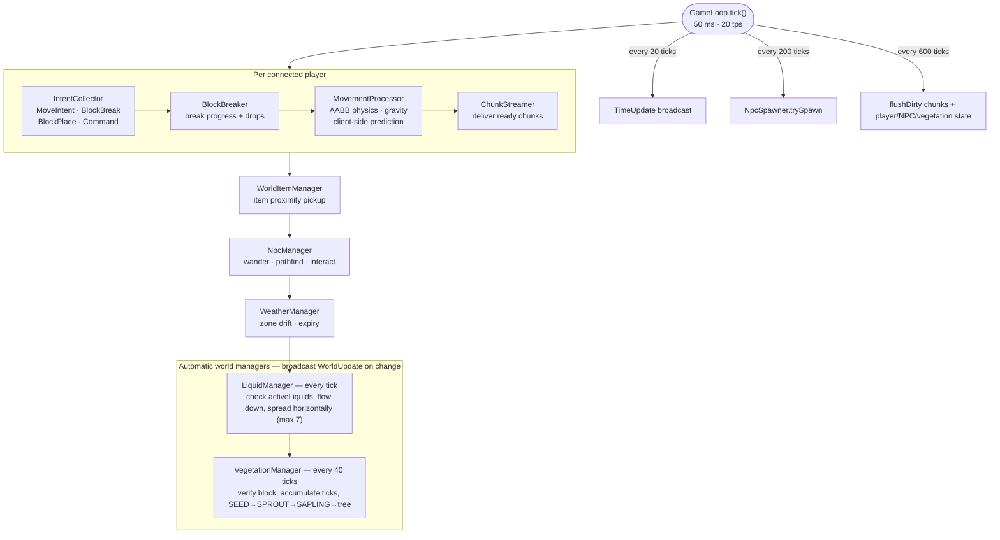

# Game loop — tick sequence

The server runs at **20 tps (50 ms/tick)**. Each tick drives player input,
physics, automatic world managers, and periodic housekeeping.

Combat runs its own processors alongside this loop (`SpellProcessor`,
`StatusEffectProcessor`, `RegenProcessor`, `ExperienceProcessor`).
