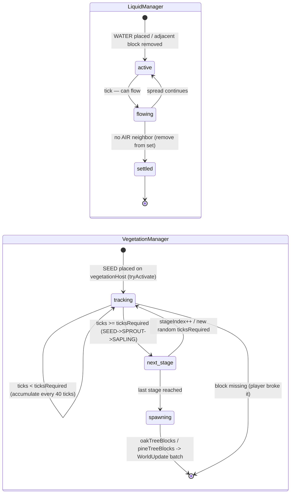

# Automatic manager state machine

Both `LiquidManager` and `VegetationManager` follow the same pattern: an
in-memory set of active positions is mutated by world events, consumed by the
tick, and produces `WorldUpdate` broadcasts to all clients.

See [Liquids](../world/liquids.md) and [Vegetation](../world/vegetation.md) for
the player-facing behaviour and the YAML that tunes each chain.
