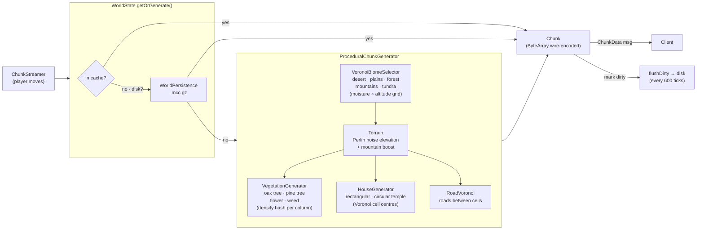

# World generation pipeline

Chunks are generated on demand: `ChunkStreamer` requests a chunk →
`WorldState.getOrGenerate()` checks the in-memory cache, then disk, then runs the
generator.

Tuning: [`biomes.yaml`](../world/biomes.md), [`houses.yaml` / `roads.yaml`](../world/structures.md),
[`vegetation.yaml`](../world/vegetation.md). Terrain constants (`WATER_LEVEL`,
`WORLD_MAX_Y`, view radius) are in [world constants](../reference/constants.md),
overridable via [`server.yaml`](../systems/server-config.md).
