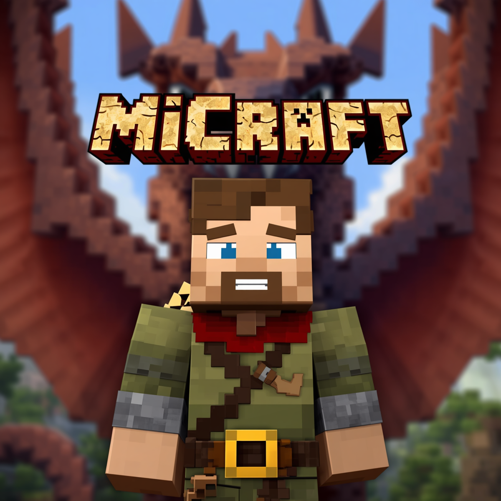

# MiCraft

**MiCraft** is a multiplayer RPG voxel game built with **Kotlin Multiplatform**.
A Ktor WebSocket server runs authoritative physics and serves a browser client
(Kotlin/Wasm + BabylonJS). It ships procedural terrain, a biome system, liquid
physics, NPC entities, weather zones, a full RPG layer, and a plugin-based
slash-command system.

This site has two jobs:

- **How to play** — controls, slash commands, and every in-game screen.
- **How to configure** — for each system, the YAML file, its keys, the JSON
  Schema, the override path, and how to reload it.

## Where to start

- New here? [Getting started](getting-started/index.md) → [Running the apps](getting-started/running.md).
- Want the mechanics? [Gameplay](gameplay/movement.md) and [World](world/biomes.md).
- Playing the RPG? [RPG overview](rpg/index.md).
- Running a server? [Server configuration](systems/server-config.md), [Auth & RBAC](systems/auth-rbac.md).
- Every command: [Slash commands](systems/slash-commands.md). Every route: [HTTP API](api-routes.md).

## Live URLs (running server)

| URL | Purpose |
|-----|---------|
| [`/`](http://127.0.0.1:8080/) | Game client |
| [`/map`](http://127.0.0.1:8080/map) | Live top-down world map |
| [`/admin/`](http://127.0.0.1:8080/admin/) | Administration panel |
| [`/api/docs`](http://127.0.0.1:8080/api/docs) | HTTP API reference (Redoc) |

## How the docs stay correct

The reference tables (blocks, items, biomes, classes, recipes, weather,
keybindings, constants…) are **generated from the real configuration** by
`:server:generateReferenceDocs` and verified in CI, exactly like the slash-command
table. If a value here disagrees with the game, the build fails.
